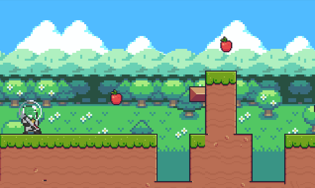

<h1>Adventure Pixel<h1> 
  
> Status: Development 🚀

Esse projeto ... 

    <a href="#sobre">Sobre</a>
    <a href="#objetivo">Objetivo</a>
    <a href="#instalação">Instalação</a>
    <a href="#pré-requisitos">Pré-Requisitos</a>
    <a href="features">Features</a>
    <a href="#autores">Autores</a>

# Sobre

No projeto em questão, estamos realizado o desenvolvimento de um jogo 2D utilizando a engine Godot. 
O jogo possuirá compatibilidade com os Sistemas Operacionais Windows, Linux e MacOS e será distribuído com base na licença GPL v3 🔓.

 

O jogo contará com uma interface 2D e conceitos de design baseados em Pixel Art, além de trazer uma
dinâmica de coleta de recursos e obstaculos, os quais serão divididos em diferentes fases com distintas tematicas durante a jogatina.

O Jogo tem como protagonista um corajoso alienigena que almeja acima de tudo o retorno para o seu lar e para isso terá diversas aventuras em diferentes mundos.
 

# Objetivo

O presente projeto tem como objetivo o desenvolvimento de um sistema interativo, aplicando as competências apresentadas no 1° semestre letivo do ano de 2022, no curso de Bacharelado em Ciência da Computação pela Universidade Nove de Julho.
 

# Instalação

# Pré Requisitos

# Features

- [x] Tela Inicial
- [x] Tela de Configurações
- [x] Tela Game Over
- [x] Level 01
- [x] Level - Final
- [x] Player
- [x] Gravidade/Colisões
- [x] Itens coletáveis
- [x] Fall Zone
- [x] Inimigos
- [x] Dano
- [x] HUD
- [x] Disparos
- [x] Plataformas Móveis
- [x] Plataformas que Cai
- [x] Checkpoint
- [x] Transição entre os Levels
- [x] Blocos
- [x] Efeitos sonoros
- [x] Armadilhas
- [x] Blocos de Interação
- [x] Boss

 
